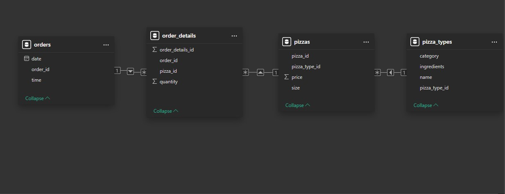

# Pizza Sales Analysis
A data-driven study of pizza sales leveraging PostgreSQL for analysis and Excel for visualization, to explore sales performance, order patterns, and strategic business opportunities.

# Project Overview
- This project meticulously details the end-to-end process of analyzing a substantial dataset comprising over 632,000 pizza sales transactions.
- Leveraging the powerful data management and analytical capabilities of PostgreSQL, the project transformed raw transactional data into actionable business intelligence.
- Key insights into sales trends, customer preferences, and operational performance were then effectively communicated through compelling visualizations using Microsoft Excel, ultimately leading to the formulation of data-driven recommendations.

# Business Context
- In today's competitive food service industry, understanding customer preferences and sales dynamics is crucial for success.
- This project addresses the need for a pizza business to gain a deeper understanding of its sales data to make informed decisions regarding marketing campaigns, inventory management, staffing, and product development.

# Data Description
The dataset follows a **Snowflake Schema**, meaning the data is normalized into multiple related tables to reduce redundancy and improve efficiency. Fact tables store transactional data, while dimension tables contain descriptive attributes, ensuring a structured and optimized database design.

The analysis is based on a dataset comprising 632,073 records, with each record representing a single pizza order. The dataset includes detailed information such as:

`order_id`: Unique identifier per transaction line.

`date`: The date each order was placed (formatted as mm/dd/yyyy).

`time`: Time-based insights to find peak ordering hours.

`quantity`, `price`: Essential for computing total revenue.

`size`: Pizza size (S, M, L, XL, XXL).

`name`, `category`, `ingredients`: Detailed breakdown of pizza variety.

# The analytical process

1. **Data Extraction & Cleaning**  
   - Imported raw sales data and performed schema validation to ensure consistency.  
   - Handled missing values by applying imputation techniques and removed duplicate records to maintain data integrity.  
   - Standardized date formats and derived additional time-based attributes such as `month`, `day_name`, `ordering_hours` and `weekend_flag` for enhanced temporal analysis.  

2. **Schema Design & Data Modeling**  
   - The dataset follows a **Snowflake Schema**, where the fact table `sales` is linked to normalized dimension tables like `products`, `customers`, and `time`.  
   - This design reduces data redundancy while preserving relational integrity, enabling efficient analytical queries.  

3. **Feature Engineering & Enrichment**  
   - Created new features such as `average order value`, `total discount applied`, and `sales per product category` to derive deeper insights.  
   - Encoded categorical variables for improved query performance and downstream modeling.  

4. **Exploratory Data Analysis (EDA)**  
   - Analyzed sales distribution, order frequency, and discount utilization to identify trends and patterns.  
   - Used visualizations like histograms and boxplots to detect outliers and understand variations in sales performance.  

5. **SQL & Analytical Queries**  
   - Leveraged **PostgreSQL** to compute aggregated metrics such as `total sales`, `discount impact on revenue`, and `customer purchase patterns`.  
   - Applied **window functions** (e.g., `SUM() OVER()`, `AVG() OVER()`) to analyze rolling sales trends over time.  

6. **Dashboard Development**  
   - Built an interactive **Excel dashboard** to visualize key metrics, including `total revenue`, `order count`, and `product category-wise sales trends`.  
   - Utilized **pivot tables and charts** for an intuitive data exploration experience.  

# Key Findings and Insights
The analysis revealed several crucial insights into pizza sales:
- **Revenue Dominance:** The business generated a significant total revenue of $801,944.7 from the processed orders.
  
- **Weekday Strength:** Weekdays contribute substantially to the overall revenue, with $583,814.65 generated during these days.
  
- **Weekend Surge:** Weekends also represent a significant portion of sales, contributing $218,130.05 in revenue.
  
- **Average Order Value:** The average order value stands at $38.31.
  
- **Friday is King:** Friday consistently shows the highest sales volume and revenue compared to other weekdays, suggesting a potential opportunity for targeted promotions.
  
- **Midweek Consistency:** Sales remain relatively steady throughout the midweek days (Tuesday, Wednesday, Thursday).
  
- **Summer Peak:** The summer months (June, July, August) appear to be the strongest in terms of revenue, while the fall months (September, October, November) show a dip. This seasonality should be considered for inventory planning and marketing efforts.
  
- **Lunch and Dinner Rush:** Peak ordering hours are concentrated around lunchtime (12 PM - 1 PM) and the early evening (6 PM - 8 PM), indicating the need for adequate staffing during these periods.
  
- **Classic Category Leads:** The 'Classic' pizza category is the most popular in terms of quantity sold, followed by 'Supreme', 'Veggie', and then 'Chicken'. The 'Chicken' category appears to lag behind, suggesting potential for exploring new chicken-based offerings or targeted promotions.
  
- **Large and Medium Reign:** Large (L) and Medium (M) are the most preferred pizza sizes, accounting for a significant portion of sales. Extra-large (XL) and extra-extra-large (XXL) sizes have minimal sales, which might warrant a review of their profitability or marketing strategy. Small (S) pizzas also have a relatively low share.
  
- **Top Pizza Performers:** The top 5 most popular pizzas drive a significant portion of the sales, each representing 20% of the top-selling items. These include "The Thai Chicken Pizza", "The Barbecue Chicken Pizza", "The Pepperoni Pizza", "The Classic Deluxe Pizza", and "The Hawaiian Pizza". This highlights the importance of these core menu items.

# Business Recommendations

1. **Elevate Weekend Sales Performance**  
   - **Observation:** Weekend revenue is significantly lower compared to weekdays.  
   - **Recommendation:** Launch exclusive “Weekend Family Combos” or “Sunday Brunch Specials” to stimulate demand. Offer limited-time discounts or loyalty rewards to encourage increased weekend orders.  
   - **Expected Impact:** This will help balance the revenue gap between weekdays and weekends and attract more group or family orders.

2. **Refine Product Portfolio & Inventory Management**  
   - **Observation:** Large and Medium pizzas dominate sales, while underperforming sizes (e.g., XXL) yield minimal returns.  
   - **Recommendation:** Consider phasing out XXL pizzas or running targeted promotions (such as “XXL Party Deal”) to optimize inventory and reduce storage costs.  
   - **Expected Impact:** Streamlining the product portfolio will reduce waste and free up resources for best-selling items.

3. **Maximize Peak Hour Sales**  
   - **Observation:** Orders peak at 12 PM – 1 PM and 6 PM – 8 PM, corresponding to lunch and dinner rushes.  
   - **Recommendation:** Enhance staffing and kitchen throughput during these windows and introduce “Lunch Express Deals” and “Dinner Value Combos” to boost average order values.  
   - **Expected Impact:** Improved service during peak hours will lead to higher customer satisfaction and increased revenue per transaction.

4. **Promote High-Margin Categories**  
   - **Observation:** Classic and Chicken pizzas consistently perform well.  
   - **Recommendation:** Emphasize these categories in marketing efforts and consider cross-selling add-ons (e.g., sides or desserts) to increase overall ticket size.  
   - **Expected Impact:** This strategy will enhance profitability by driving up the average order value.

5. **Leverage Seasonal Trends**
   -  **Observation:** Sales data reveals a distinct seasonal pattern: revenue consistently peaks during the summer months, while the fall season, particularly October, shows a significant decline in sales.  
   - **Recommendation:** Develop a targeted seasonal marketing calendar that capitalizes on the robust summer period with premium promotions and new product offerings, while implementing special fall campaigns—such as exclusive loyalty initiatives and discount bundles—to counteract the seasonal dip.  
   - **Expected Impact:** By addressing the fall downturn and leveraging the high-selling summer period, the strategy will help smooth out seasonal fluctuations, ensuring a more consistent revenue stream throughout the year.

# Tools & Methodologies

- **PostgreSQL for Data Processing:**  
  Handled around 603,200 records with a Snowflake Schema, ensuring data is normalized and query performance is optimized.  
  More details in the [SQL Analysis Presentation](sql_analysis_presentation.pdf).

- **SQL Query Engineering:**  
  Implemented efficient SQL scripts to extract vital sales metrics.  
  Check out the code in [Pizza Sales Code](pizza%20sales%20code.sql).

- **Excel for Data Transformation & Visualization:**  
  The cleaned and aggregated data was transformed and visualized in Excel, creating a dynamic dashboard for actionable insights.  
  Access the transformation process in [Excel Transformed Data](transformed_data_sales.xlsx).

# Conclusion

- I have successfully leveraged advanced data processing and analytical techniques to transform roughly 603,200 records of pizza sales into actionable business insights.
- Utilizing PostgreSQL with a Snowflake Schema ensured optimal data normalization and performance, while sophisticated SQL queries extracted critical metrics that were presented via an Excel dashboard.
- This project is a reflection of my strong technical abilities and strategic acumen, showcasing my capacity to deliver high-impact, data-driven solutions that drive business success.

