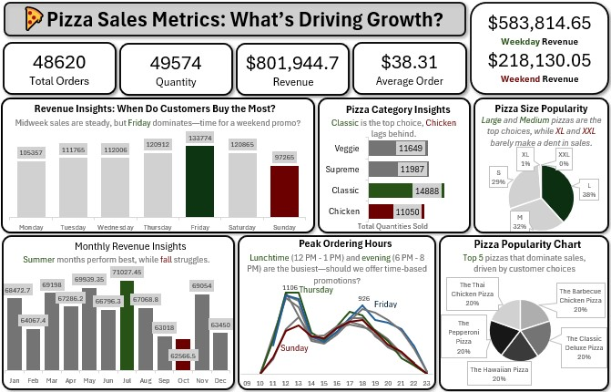

# Pizza Sales Analysis
A data-driven study of pizza sales leveraging PostgreSQL for analysis and Excel for visualization, to explore sales performance, order patterns, and strategic business opportunities.

# Project Overview
- This project meticulously details the end-to-end process of analyzing a substantial dataset comprising over 632,000 pizza sales transactions.
- Leveraging the powerful data management and analytical capabilities of PostgreSQL, the project transformed raw transactional data into actionable business intelligence.
- Key insights into sales trends, customer preferences, and operational performance were then effectively communicated through compelling visualizations using Microsoft Excel, ultimately leading to the formulation of data-driven recommendations.

# Business Context
- In today's competitive food service industry, understanding customer preferences and sales dynamics is crucial for success.
- This project addresses the need for a pizza business to gain a deeper understanding of its sales data to make informed decisions regarding marketing campaigns, inventory management, staffing, and product development.

